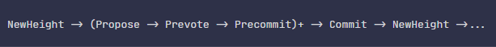
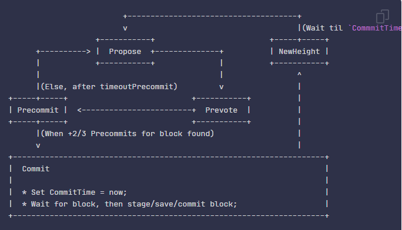

# Bài toán về sự đồng thuận
## 1. Bài toán về các vị tướng Byzantine
Bài toán các vị tướng Byzantine được đưa ra bởi 3 nhà khoa học máy tính Leslie Lamport, Robert Shostak và Marshall Pease trong một báo cáo khoa học mang tên “The Byzantine Generals Problem” vào năm 1982.

Bài toán các vị tướng Byzantine miêu tả về một nhóm các vị tướng trong đội quân Byzantine (quân đội đế quốc Đông La Mã), tiến hành vây hãm 1 thành phố. Các vị tướng cần trao đổi để đạt được đến 1 thỏa thuận về kế hoạch tấn công thành phố đó. Trong trường hợp đơn giản nhất, họ thoả thuận về việc nên tấn công hay rút lui. Một số có thể muốn tấn công, nhưng một số thì lại muốn rút lui, và vấn đề là nếu chỉ có một bộ phận tấn công riêng lẻ, thì họ sẽ gặp thất bại, và đó là kế hoạch tồi tệ hơn việc cùng tấn công hoặc cùng rút lui.

Mọi thứ sẽ trở nên phức tạp khi mà một vị tướng sẽ có thể gửi tin nhắn đi cho các vị tướng khác. Chẳng hạn như trong trường hợp có 5 vị tướng, 2 ông đã phát tín hiệu muốn tấn công, 2 ông đã phát tín hiệu muốn rút lui, còn ông thứ 5 lại chơi trò 2 mang, nhắn với 2 ông muốn tấn công rằng mình muốn tấn công, còn nhắn với 2 ông muốn rút lui rằng mình sẽ rút lui. Khi đó phe tấn công nghĩ rằng tấn công là lựa chọn đa số và họ tấn công (và sẽ thất bại), phe rút lui thì nghĩ rằng rút lui là lựa chọn đa số và họ rút lui. Họ đã không đạt được sự đồng thuận (về việc có cùng ý kiến).
Kịch bản của các tướng Byzantine là một sự tương tự cho vấn đề mà các hệ thống máy tính phân tán phải đối mặt: Làm thế nào để chúng ta đạt được sự đồng thuận khi phải đối mặt với các tác nhân không đáng tin cậy và gặp trục trặc đe dọa gây mất ổn định hệ sinh thái?

## 2. BFT (Byzantine Fault Tolerance)
Byzantine Fault Tolerance là khả năng đảm bảo cho một mạng máy tính phân tán hoạt động như mong muốn và đạt được sự đồng thuận chính xác mặc cho sự tham gia và ảnh hưởng của thành phần độc hại (các nút) hoặc do các lỗi trong hệ thống trong quá trình truyền dẫn thông tin. Các giao thức dựa trên BFT tìm cách giảm thiểu ảnh hưởng mà các nút độc hại có thể gây ra trên mạng lưới nhằm đảm bảo cho các nút trung thực vẫn duy trì được hoạt động đúng và đạt được sự đồng thuận. Có rất nhiều các giao thức đồng thuận được thiết kế dựa trên nguyên tắc này.

Các loại lỗi Byzantine: Có hai loại lỗi được xem xét. Một là lỗi dừng (trong đó nút bị lỗi và ngừng hoạt động) và loại khác là lỗi nút tùy ý. Một số lỗi nút tùy ý được đưa ra dưới đây:
Không trả lại kết quả
- Trả lời với một kết quả không chính xác
- Trả lời với một kết quả cố tình gây hiểu lầm
- Phản hồi với một kết quả khác cho các phần khác nhau của hệ thống

# Các thuật toán đồng thuận
## practical Byzantine Fault Tolenrance (pBFT)
Được giới thiệu vào cuối những năm 90 bởi Barbara Liskov và Miguel Castro. **pBFT** được thiết kế để hoạt động hiệu quả trong môi trường bất đồng bộ

Mô hình pBFT chủ yếu tập trung vào việc cung cấp một bản sao máy trạng thái, chịu được các lỗi Byzantine (các nút độc hại). Thuật toán được thiết kế để hoạt động trong các hệ thống không đồng bộ và được tối ưu hóa để có hiệu suất cao.

Về cơ bản, tất cả các nút trong mô hình pBFT được sắp xếp theo thứ tự từ 0 đến n-1, trong đó n là số nút mạng. Với một nút là nút chính(nút leader, nút primary) và các nút khác được gọi là các nút dự phòng (back-up). Tất cả các nút trong hệ thống giao tiếp với nhau và mục tiêu là để tất cả các nút trung thực đi đến thỏa thuận về trạng thái của hệ thống thông qua đa số. Các nút giao tiếp với nhau rất nhiều và không chỉ phải chứng minh rằng các tin nhắn đến từ một nút ngang hàng cụ thể, mà còn cần xác minh rằng tin nhắn không bị sửa đổi trong quá trình truyền dẫn.

Để mô hình pBFT hoạt động, giả định là số lượng nút độc hại trong mạng không thể bằng hoặc vượt quá 1/3 tổng số nút trong hệ thống. Khi càng có nhiều nút trong hệ thống, thì càng khó để gây ra các hành vi độc hại.

Khi mạng phát triển, các nút di chuyển qua một loạt các view. View là khoảng thời gian mà một nút nhất định là nút primary của mạng. Nói một cách dễ hiểu, mỗi nút lần lượt là nút primary trong một chu kỳ không bao giờ kết thúc, bắt đầu từ nút đầu tiên.

Ví dụ đối với mạng 4 nút, nút 0 là nút primary trong view 0, nút 1 là nút primary trong view 1, v.v..Khi mạng đến view 4, nó sẽ quay lại nút 0 là nút primary.

Theo thuật ngữ kỹ thuật hơn, nút primary (p) cho mỗi view được xác định dựa trên số thứ tự của view (v) và thứ tự của nút. Công thức để xác định primary cho một view là p=v mod n.

Ví dụ: Trên một mạng 4 nút tại view 7, theo công thức p=7mod4=3, có nghĩa là nút thứ 3 sẽ là nút primary trong view 7.

Mỗi vòng đồng thuận pBFT (được gọi là lượt xem) gồm 4 giai đoạn.
- Một nút nào đó gửi yêu cầu đến nút chính để yêu cầu xác thực.
- Nút chính đồng thời gửi yêu cầu xác thực đến các nút dự phòng.
- Các nút dự phòng tiến hành xác thực yêu cầu và sau đó gửi lại phản hồi.
- Khi chờ đủ f + 1 (f đại diện cho số lượng nút tối đa có thể bị lỗi) phản hồi từ các nút khác nhau có cùng kết quả thì kết quả này sẽ là kết quả cuối cùng của hoạt động. Chấp nhận hoặc không chấp nhận yêu cầu xác thực.

|\\|request|pre-prepare|prepare|commit|reply|
|---|---|---|---|---|---|
|Min|1|3f|(3f-f)\*3f | (3f+1-f)*3f| 3f-f+1|
|Max|1 | 3f| (3f)\*2 | (3f+1)\*3f| 3f+1|

Node primary có thể được thay đổi theo vòng hoặc thay thế bằng các giao thức lựa chọn. Đa số các nút trung thực cũng có thể quyết định liệu nút chính có bị lỗi hay không và loại bỏ chúng để thay thế bằng các nút chính khác.

### **View change:**
Khi một node xác định node primary của view v bị lỗi (có thể do nút primary đã gửi một thông báo không hợp lệ hoặc không tạo ra một khối hợp lệ kịp thời), nó sẽ phát một thông báo view change cho view (v+1) tới mạng. Nếu node primary thực sự bị lỗi, tất cả các node không bị lỗi sẽ phát thông báo view change. Khi node primary mới của view (v+1) nhận 2f+1 tin nhắn view change từ khác node khác, nó sẽ broadcast tin nhắn new view của view (v+1) tới tất cả các node. Khi các node khác nhận được tin nhắn new view này, chúng sẽ chuyển sang chế độ new view và node primary mới sẽ bắt đầu xuất bản các khối và gửi các tin nhắn pre-prepare.

View change đảm bảo rằng hệ thống có thể chuyển sang node primary mới nếu node primary hiện tại đang bị lỗi. Tính năng PBFT này cho phép mạng tiếp tục phát triển và không bị đình trệ bởi một nút primary bị lỗi.

**Ưu điểm:** Thông lượng giao dịch cao có thể lên tới hàng trăm ngàn giao dịch một giây.

**Nhược điểm**:

- Tính mở rộng không tốt bới vì là một giao thức sử dụng broadcast. Khi số lượng các node trong mạng tăng lên (O(n^k), với n là số lượng message và k là số lượng các node), dẫn đến thời gian phản hồi các yêu cầu cũng tăng theo
- Một phần vì khả năng mở rộng kém hiệu quả của thuật toán, khi một người kiểm soát nhiều node trong mạng, họ có thể thực hiện điều họ muốn

 

## Tendermint
Thuật toán bắt đầu bởi một **proposer** (phase **propose**), nó sẻ gửi một block được đề xuất cho tất cả các node (**validators**). Khi các node nhận được thông tin từ **proposer**, các node sẻ tiến hành broadcast các thông điệp **prevote** cho nhau (phase **prevote**). Sau đó các node sẻ đợi 1 khoảng thời gian để nhận các thông điệp **prevote** mà các node khác đã gửi. Nếu một node nhận nhiều hơn 2/3 thông điệp **prevote** cho cùng một block thì node đó thực hiện broadcast thông điệp precommit (phase **precommit**) và nếu không nhận đủ 2/3 thì ngược lại. Các node nhận được nhiều hơn 2/3 các thông điệp precommit cho cùng một block thì sẻ thực hiện commit block đó, ngược lại nếu nhận không đủ, việc commit block đó sẻ thất bại. Khi đó một **round** mới được thực hiện với một **proposer** mới

**Proposer** mới được bầu chọn xoay vòng giữa các node.

Thứ tự các bước **Propose --> Prevote --> Precommit** được gọi là một **round**. Ngoài các bước cơ bản thì còn có các bước đặt biệt `Commit` và `NewHeight`.

**State Machine Diagram**

**Nhận xét**

- PBFT thay đổi primary chỉ khi nào primary bị lỗi, còn Tendermint thay đổi qua từng round
- PBFT có 2 mode (normal, view change) còn Tendermint có 1 mode
- PBFT xử lý request song song, còn Tendermint xử lý tuần tự
- 

## Multiview

